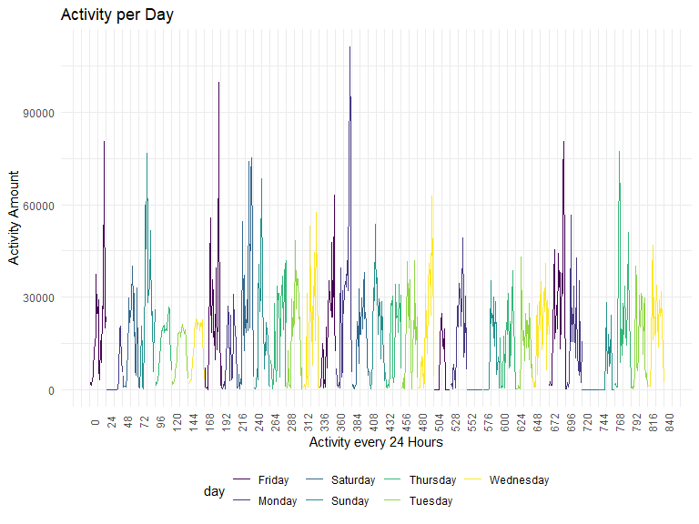

Homework 3
================
CJ Snyder
10/10/2019

# **Problem 1 - Uploading *Instacart* Dataset:**

``` r
library(p8105.datasets)
data ("instacart")

instacart
```

## **Dataset Description:**

The instacart dataset includes 1384617 observations, along with 15
variables including: order\_id, product\_id, add\_to\_cart\_order,
reordered, user\_id, eval\_set, order\_number, order\_dow,
order\_hour\_of\_day, days\_since\_prior\_order, product\_name,
aisle\_id, department\_id, aisle, department.

Each item within an order is linked together using a particular
*order\_id* and *product\_id*, and includes information like when the
order was made (*order\_dow*, and *order\_hour\_of\_day*), as well as
where the item is located within the store (*aisle\_id, department\_id,
aisle, department*) and whether or not this item is being re-ordered
(*reordered*). The amount of items ordered from each department is
summarized in the below bar chart:


The largest number of orders occured on Sunday according to the below
chart:


The total number of aisles collected by *Instacart* is 134. The aisle
that had the most items ordered from it was **fresh vegetables** with
*150609* items bought, followed closely by **fresh fruits** with
*150473* items bought.

The aisles that had over 10,000 items bought from them are shown in the
below plot (organized from the items that were bought the most to those
that were bought the
least):


The three most popular items bought from aisles labeled as *“baking
ingredients”*, *“dog food care”*, and *“packaged vegetables fruits”* are
as
follows:

| Aisle                      | Prodcut ID | Product Name                                  | Amount Bought |
| :------------------------- | ---------: | :-------------------------------------------- | ------------: |
| baking ingredients         |      23405 | Pure Baking Soda                              |           387 |
| baking ingredients         |      23537 | Light Brown Sugar                             |           499 |
| baking ingredients         |      49533 | Cane Sugar                                    |           336 |
| dog food care              |        722 | Snack Sticks Chicken & Rice Recipe Dog Treats |            30 |
| dog food care              |      17471 | Small Dog Biscuits                            |            26 |
| dog food care              |      23329 | Organix Chicken & Brown Rice Recipe           |            28 |
| packaged vegetables fruits |      21903 | Organic Baby Spinach                          |          9784 |
| packaged vegetables fruits |      27966 | Organic Raspberries                           |          5546 |
| packaged vegetables fruits |      39275 | Organic Blueberries                           |          4966 |

For “baking ingredients”, the three most bought items include *Pure
Baking Soda*, *Light Brown Sugar*, and *Cane Sugar*. For “dog food
care”, they include *Snack Sticks Chicken & Rice Recipe Dog Treats*,
*Small Dog Biscuits*, and *Organix Chicken & Brown Rice Recipe*. For
“packaged vegetables fruits”, they include *Organic Baby Spinach*,
*Organic Raspberries*, and *Organic Blueberries*.

The mean hour of the day in which *Pink Lady Apples* and *Coffee Ice
Cream* are ordered throughout the week are listed in the table
below:

| product\_name    |   Sunday |   Monday |  Tuesday | Wednesday | Thursday |   Friday | Saturday |
| :--------------- | -------: | -------: | -------: | --------: | -------: | -------: | -------: |
| Pink Lady Apples | 13.44118 | 11.36000 | 11.70213 |  14.25000 | 11.55172 | 12.78431 | 11.93750 |
| Coffee Ice Cream | 13.77419 | 14.31579 | 15.38095 |  15.31818 | 15.21739 | 12.26316 | 13.83333 |

According to the above table, it seems as thought “Pink Lady Apples” are
purchased the earliest on Monday, and the latest on Wednesday.
Meanwhile, “Coffee Ice Cream” is purchased the earliest on Friday, and
the latest on Tuesday.

# **Problem 2 - Uploading *BRFSS* Dataset:**

``` r
library(p8105.datasets)
data("brfss_smart2010")

brfss_smart2010
```

## Data Cleaning for *brfss\_smar2010* dataset:

``` r
names(brfss_smart2010)[] <- tolower(names(brfss_smart2010)[])

brfss_smart2010 %>% 
  filter(topic=="Overall Health") %>% 
  count(response)
```

    ## # A tibble: 5 x 2
    ##   response      n
    ##   <chr>     <int>
    ## 1 Excellent  2125
    ## 2 Fair       2125
    ## 3 Good       2125
    ## 4 Poor       2125
    ## 5 Very good  2125

``` r
brfss_smart2010 = 
  brfss_smart2010 %>% 
    filter(topic=="Overall Health",
           response %in% c("Excellent", "Fair", "Good", "Poor")
           ) %>%
  mutate(
    response = as.character(response),
    response = factor(response,levels=c("Poor", "Fair", "Good", "Excellent"))
  )
```

### Question 2a

``` r
brfss_2002 = 
  brfss_smart2010 %>% 
    filter(year=="2002") %>% 
    group_by(locationabbr) %>% 
    summarize(
      unique_location = n_distinct(locationdesc)
    ) %>% 
  filter(unique_location>=7)

kable(brfss_2002)
```

| locationabbr    |                                                                                                                                                     unique\_location |
| :-------------- | -------------------------------------------------------------------------------------------------------------------------------------------------------------------: |
| CT              |                                                                                                                                                                    7 |
| FL              |                                                                                                                                                                    7 |
| MA              |                                                                                                                                                                    8 |
| NC              |                                                                                                                                                                    7 |
| NJ              |                                                                                                                                                                    8 |
| PA              |                                                                                                                                                                   10 |
| In 2002, the st | ates that had 7 or more locations from which the government collected data include Connecticut, Florida, Massachusetts, North Carolina, New Jersey, and Pennsylvania |

``` r
brfss_2010 = 
  brfss_smart2010 %>% 
    filter(year=="2010") %>% 
    group_by(locationabbr) %>% 
    summarize(
      unique_location = n_distinct(locationdesc)
    ) %>% 
  filter(unique_location>=7)

kable(brfss_2010)
```

| locationabbr   |                                                                                                                                                                                                                                          unique\_location |
| :------------- | --------------------------------------------------------------------------------------------------------------------------------------------------------------------------------------------------------------------------------------------------------: |
| CA             |                                                                                                                                                                                                                                                        12 |
| CO             |                                                                                                                                                                                                                                                         7 |
| FL             |                                                                                                                                                                                                                                                        41 |
| MA             |                                                                                                                                                                                                                                                         9 |
| MD             |                                                                                                                                                                                                                                                        12 |
| NC             |                                                                                                                                                                                                                                                        12 |
| NE             |                                                                                                                                                                                                                                                        10 |
| NJ             |                                                                                                                                                                                                                                                        19 |
| NY             |                                                                                                                                                                                                                                                         9 |
| OH             |                                                                                                                                                                                                                                                         8 |
| PA             |                                                                                                                                                                                                                                                         7 |
| SC             |                                                                                                                                                                                                                                                         7 |
| TX             |                                                                                                                                                                                                                                                        16 |
| WA             |                                                                                                                                                                                                                                                        10 |
| While in 2010, | the stats that had 7 or more locations from which the government collected data include California, Colorodo, Florida, Massachusetts, Maryland, North Carolina, Nebraska, New Jersey, New York, Ohio, Pennsylvania, South Carolina, Texas and Washington. |

### Question 2b

``` r
brfss_excel_df = 
  brfss_smart2010 %>% 
    filter(response=="Excellent") %>% 
  group_by(year, locationabbr) %>% 
  mutate(
    mean_data_value = mean(data_value)
  ) %>% 
  select(year, locationabbr, mean_data_value) %>% 
  distinct()
```

#### **Spaghetti-Plot**

``` r
brfss_excel_df %>% 
  ggplot(aes(x=year, y=mean_data_value, group=locationabbr)) +
    geom_line(aes(color=locationabbr)) + 
  labs(
    x = "Year Data was Collected",
    y = "Mean Value of Data Value Across State Collection Locations"
  ) +
  theme(legend.key.width = unit(3,"cm"),
        legend.key.height = unit(0.25, "cm")) 
```


Overall the average “data value” seems to be decreasing over time (from
2002 - 2010) for all participating states. Over the span of this time
frame, there seems to be large variability in the average “data value”
for some states. However, there seems to be a trend over this range of
time that indicates that West Viginia seems to have the lowest overall
data value, while Washington D.C.s seems to have the greatest overall
value.

### Question 2c

``` r
ny_plot_2006 = 
  brfss_smart2010 %>% 
  filter(year=="2006",
         locationabbr=="NY") %>%
  ggplot(aes(x=locationdesc, y=data_value, group=response, color=response)) +
  geom_point() +
  labs(
    title = "NY State 2006 BRFSS Data",
    x = "Data Collection Locations",
    y = "Data Value"
  )
ny_plot_2006
```

``` r
ny_plot_2010 = 
  brfss_smart2010 %>% 
  filter(year=="2010",
         locationabbr=="NY") %>%
  ggplot(aes(x=locationdesc, y=data_value, group=response, color=response)) +
  geom_point() +
  labs(
    title = "NY State 2010 BRFSS Data",
    x = "Data Collection Locations",
    y = "Data Value"
  ) +
  theme(axis.text.x = element_text(size=8,angle=45,vjust=0.45))
ny_plot_2010
```

#### 2006 & 2010 Distribution of Response-Type Data Value by NY State Location


In 2006, the data value for any given “poor” response-type seemed very
similar across locations. This can also be seen with any given “fair”
response-type. However, when looking at “good” and “excellent”
response-types, there seems to be some variability about how they are
classified. For example, in all locations except for *New York County*
the “good” response type had a high data value than the “excellent”
response-type. And the difference between these two responses also
varried greatly, with *Kings County* having the greatest difference,
while for *Westchester County* the values are practically the same.

Similarly to the 2006 dataset, the 2010 dataset still retains the same
pattern of similar data value for “poor” and “fair” response-types
across the various NY-state data collection locations. It is impotant to
note that there are 3 additional locations that were established by
2010, including: *Bronx County*, *Erie County*, and *Monroe County*. In
addition to *New York County*, now *Monroe County*, and *Westchester
County* have it so that their “excellent” response-type have a greater
value than their “good” response-types. Also, instead of *Kings County*,
it now appears that *Bronx County* has the greatest difference between
its “good” and “excellent” response-type data values.

# **Problem 3 - Uploading the *Accelerometer* Dataset:**

``` r
accel_df = read_csv(file="./data/accel_data.csv") %>% 
  janitor::clean_names() %>% 
  mutate(
    day = as.character(day),
    dow = factor(day, c("Saturday", "Sunday", "Monday", "Tuesday", "Wednesday", "Thursday", "Friday"), labels=c("Weekend", "Weekend", "Weekday", "Weekday", "Weekday", "Weekday", "Weekday"))
  )
```

    ## Parsed with column specification:
    ## cols(
    ##   .default = col_double(),
    ##   day = col_character()
    ## )

    ## See spec(...) for full column specifications.

``` r
accel_df[,4:1443] <- sapply(accel_df[, c(4:1443)], as.integer)
```

The *accel\_df* contains 35 observations with 1444 variables. The
majority of the varibales are activity counts for each minute of the day
(starting at midnight, or 12 A.M.), or a total of 1,440 minutes per day.
Each row represents a specific day of the week for the 7 total weeks
data was colleceted on the subject (i.e. 35 totals rows).

## Total Activity for Each Day

``` r
accel_df = 
  accel_df %>%
  mutate(
    total_activity = select(., 4:1443) %>% apply(1, sum, na.rm=TRUE)
  ) 
```

``` r
accel_df_table =
  accel_df %>% 
  select(week, day_id, day, dow, total_activity) %>% 
  rename("Week" = week,
         "Day ID" = day_id,
         "Day of the Week" = day,
         "Weekday/Weekend" = dow,
         "Total Activity" = total_activity)

kable(accel_df_table)
```

| Week | Day ID | Day of the Week | Weekday/Weekend | Total Activity |
| ---: | -----: | :-------------- | :-------------- | -------------: |
|    1 |      1 | Friday          | Weekday         |         480280 |
|    1 |      2 | Monday          | Weekday         |          78674 |
|    1 |      3 | Saturday        | Weekend         |         376254 |
|    1 |      4 | Sunday          | Weekend         |         631105 |
|    1 |      5 | Thursday        | Weekday         |         355218 |
|    1 |      6 | Tuesday         | Weekday         |         306377 |
|    1 |      7 | Wednesday       | Weekday         |         339402 |
|    2 |      8 | Friday          | Weekday         |         568839 |
|    2 |      9 | Monday          | Weekday         |         295431 |
|    2 |     10 | Saturday        | Weekend         |         607175 |
|    2 |     11 | Sunday          | Weekend         |         422018 |
|    2 |     12 | Thursday        | Weekday         |         474048 |
|    2 |     13 | Tuesday         | Weekday         |         423245 |
|    2 |     14 | Wednesday       | Weekday         |         440962 |
|    3 |     15 | Friday          | Weekday         |         467420 |
|    3 |     16 | Monday          | Weekday         |         685910 |
|    3 |     17 | Saturday        | Weekend         |         382928 |
|    3 |     18 | Sunday          | Weekend         |         467052 |
|    3 |     19 | Thursday        | Weekday         |         371230 |
|    3 |     20 | Tuesday         | Weekday         |         381507 |
|    3 |     21 | Wednesday       | Weekday         |         468869 |
|    4 |     22 | Friday          | Weekday         |         154049 |
|    4 |     23 | Monday          | Weekday         |         409450 |
|    4 |     24 | Saturday        | Weekend         |           1440 |
|    4 |     25 | Sunday          | Weekend         |         260617 |
|    4 |     26 | Thursday        | Weekday         |         340291 |
|    4 |     27 | Tuesday         | Weekday         |         319568 |
|    4 |     28 | Wednesday       | Weekday         |         434460 |
|    5 |     29 | Friday          | Weekday         |         620860 |
|    5 |     30 | Monday          | Weekday         |         389080 |
|    5 |     31 | Saturday        | Weekend         |           1440 |
|    5 |     32 | Sunday          | Weekend         |         138421 |
|    5 |     33 | Thursday        | Weekday         |         549658 |
|    5 |     34 | Tuesday         | Weekday         |         367824 |
|    5 |     35 | Wednesday       | Weekday         |         445366 |

Looking at the table of total activity over the 35 days data was
collected on the subject, there was overall more activity at the
beginning of observation, which diminished over time. The amount of
activity seems to be fairly consistent throughout the week, but then the
amount of activity from Friday to Monday drastically shifts from a lot
to very little.

## 24-Hour Activity by Day Followed

``` r
accel_df_plot = 
  accel_df %>% 
  pivot_longer(
    activity_1:activity_1440,
    names_to = "activity_min",
    names_prefix = "activity_",
    values_to = "activity"
  ) %>% 
  select(-total_activity) %>% 
  mutate(
    activity_min = as.numeric(activity_min)
  )

accel_df_plot = 
  accel_df_plot %>% 
    group_by(activity_min = gl(ceiling(50400/60), 60, 50400)) %>% 
    mutate(hour_sum=sum(activity)) %>% 
    rename("activity_hour" = activity_min) %>% 
    ungroup() %>% 
    mutate(activity_hour = as.numeric(activity_hour))

activity_plot = 
  accel_df_plot %>% 
  ggplot(aes(x=activity_hour, y=hour_sum, group=day_id)) +
    geom_line(aes(color=day)) + 
  labs(
    title = "Activity per Day",
    x = "Activity every 24 Hours",
    y = "Activity Amount"
  ) +
  scale_x_continuous(
    breaks = seq(0, 840, 24)
  ) +
   theme(axis.text.x = element_text(angle=90))

activity_plot
```



The plot illustrates more clearly the patterns of activity that were
seen in the above table. Where, at the initiation of observations there
was overall a greater amount of activity than at the end of observation.
A lot of the spike in activity occurred over the weekend, while activity
was more or less steady throughout the weeekdays. Additionally, there
are patterns of extremely small amounts of activity on a few Mondays and
Sundays. This could be from forgetting to have worn the accelerometer,
especially since the amount of activity is so small compared to all
other times.
