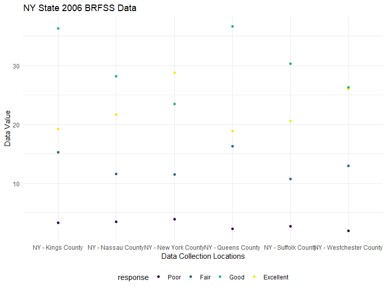
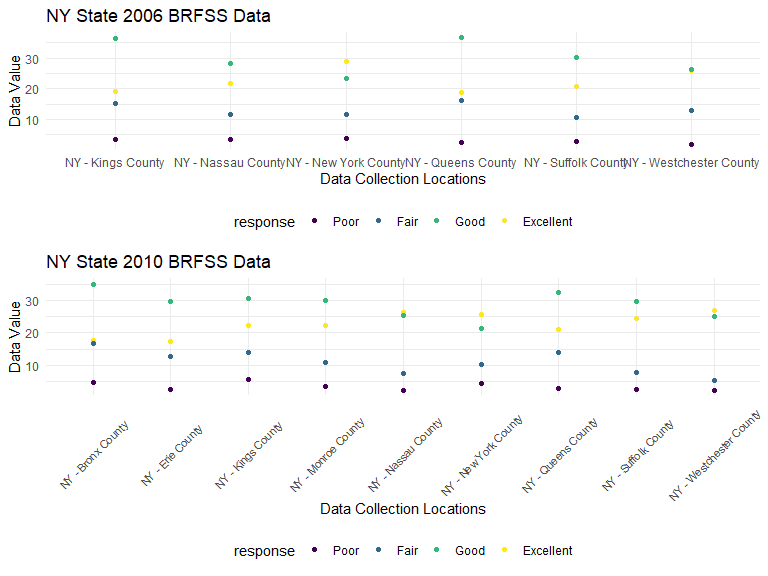

Homework 3
================
CJ Snyder
10/10/2019

# **Problem 1 - Uploading *Instacart* Dataset:**

``` r
library(p8105.datasets)
data ("instacart")

instacart
```

## **Dataset Description:**

The instacart dataset includes 1384617 observations, along with 15
variables including: order\_id, product\_id, add\_to\_cart\_order,
reordered, user\_id, eval\_set, order\_number, order\_dow,
order\_hour\_of\_day, days\_since\_prior\_order, product\_name,
aisle\_id, department\_id, aisle, department.

Each item within an order is linked together using a particular
*order\_id* and *product\_id*, and includes information like when the
order was made (*order\_dow*, and *order\_hour\_of\_day*), as well as
where the item is located within the store (*aisle\_id, department\_id,
aisle, department*) and whether or not this item is being re-ordered
(*reordered*). The amount of items ordered from each department is
summarized in the below bar chart:


The largest number of orders occured on Sunday according to the below
chart:


The total number of aisles collected by *Instacart* is 134. The aisle
that had the most items ordered from it was **fresh vegetables** with
*150609* items bought, followed closely by **fresh fruits** with
*150473* items bought.

The aisles that had over 10,000 items bought from them are shown in the
below plot (organized from the items that were bought the most to those
that were bought the
least):


The three most popular items bought from aisles labeled as *“baking
ingredients”*, *“dog food care”*, and *“packaged vegetables fruits”* are
as follows:

    ## # A tibble: 9 x 4
    ## # Groups:   Aisle [3]
    ##   Aisle           `Prodcut ID` `Product Name`               `Amount Bought`
    ##   <chr>                  <int> <chr>                                  <int>
    ## 1 baking ingredi~        23405 Pure Baking Soda                         387
    ## 2 baking ingredi~        23537 Light Brown Sugar                        499
    ## 3 baking ingredi~        49533 Cane Sugar                               336
    ## 4 dog food care            722 Snack Sticks Chicken & Rice~              30
    ## 5 dog food care          17471 Small Dog Biscuits                        26
    ## 6 dog food care          23329 Organix Chicken & Brown Ric~              28
    ## 7 packaged veget~        21903 Organic Baby Spinach                    9784
    ## 8 packaged veget~        27966 Organic Raspberries                     5546
    ## 9 packaged veget~        39275 Organic Blueberries                     4966

For “baking ingredients”, the three most bought items include *Pure
Baking Soda*, *Light Brown Sugar*, and *Cane Sugar*. For “dog food
care”, they include *Snack Sticks Chicken & Rice Recipe Dog Treats*,
*Small Dog Biscuits*, and *Organix Chicken & Brown Rice Recipe*. For
“packaged vegetables fruits”, they include *Organic Baby Spinach*,
*Organic Raspberries*, and *Organic Blueberries*.

The mean hour of the day in which *Pink Lady Apples* and *Coffee Ice
Cream* are ordered throughout the week are listed in the table below:

    ## # A tibble: 2 x 8
    ##   product_name     Sunday Monday Tuesday Wednesday Thursday Friday Saturday
    ##   <chr>             <dbl>  <dbl>   <dbl>     <dbl>    <dbl>  <dbl>    <dbl>
    ## 1 Pink Lady Apples   13.4   11.4    11.7      14.2     11.6   12.8     11.9
    ## 2 Coffee Ice Cream   13.8   14.3    15.4      15.3     15.2   12.3     13.8

According to the above table, it seems as thought “Pink Lady Apples” are
purchased the earliest on Monday, and the latest on Wednesday.
Meanwhile, “Coffee Ice Cream” is purchased the earliest on Friday, and
the latest on Tuesday.

# **Problem 2 - Uploading *BRFSS* Dataset:**

``` r
library(p8105.datasets)
data("brfss_smart2010")

brfss_smart2010
```

## Data Cleaning for *brfss\_smar2010* dataset:

``` r
names(brfss_smart2010)[] <- tolower(names(brfss_smart2010)[])

brfss_smart2010 %>% 
  filter(topic=="Overall Health") %>% 
  count(response)
```

    ## # A tibble: 5 x 2
    ##   response      n
    ##   <chr>     <int>
    ## 1 Excellent  2125
    ## 2 Fair       2125
    ## 3 Good       2125
    ## 4 Poor       2125
    ## 5 Very good  2125

``` r
brfss_smart2010 = 
  brfss_smart2010 %>% 
    filter(topic=="Overall Health",
           response %in% c("Excellent", "Fair", "Good", "Poor")
           ) %>%
  mutate(
    response = as.character(response),
    response = factor(response,levels=c("Poor", "Fair", "Good", "Excellent"))
  )
```

### Question 2a

``` r
brfss_2002 = 
  brfss_smart2010 %>% 
    filter(year=="2002") %>% 
    group_by(locationabbr) %>% 
    summarize(
      unique_location = n_distinct(locationdesc)
    ) %>% 
  filter(unique_location>=7)

print(brfss_2002)
```

    ## # A tibble: 6 x 2
    ##   locationabbr unique_location
    ##   <chr>                  <int>
    ## 1 CT                         7
    ## 2 FL                         7
    ## 3 MA                         8
    ## 4 NC                         7
    ## 5 NJ                         8
    ## 6 PA                        10

In 2002, the states that had 7 or more locations from which the
government collected data include Connecticut, Florida, Massachusetts,
North Carolina, New Jersey, and Pennsylvania

``` r
brfss_2010 = 
  brfss_smart2010 %>% 
    filter(year=="2010") %>% 
    group_by(locationabbr) %>% 
    summarize(
      unique_location = n_distinct(locationdesc)
    ) %>% 
  filter(unique_location>=7)

print(brfss_2010)
```

    ## # A tibble: 14 x 2
    ##    locationabbr unique_location
    ##    <chr>                  <int>
    ##  1 CA                        12
    ##  2 CO                         7
    ##  3 FL                        41
    ##  4 MA                         9
    ##  5 MD                        12
    ##  6 NC                        12
    ##  7 NE                        10
    ##  8 NJ                        19
    ##  9 NY                         9
    ## 10 OH                         8
    ## 11 PA                         7
    ## 12 SC                         7
    ## 13 TX                        16
    ## 14 WA                        10

While in 2010, the stats that had 7 or more locations from which the
government collected data include California, Colorodo, Florida,
Massachusetts, Maryland, North Carolina, Nebraska, New Jersey, New York,
Ohio, Pennsylvania, South Carolina, Texas and Washington.

### Question 2b

``` r
brfss_excel_df = 
  brfss_smart2010 %>% 
    filter(response=="Excellent") %>% 
  group_by(year, locationabbr) %>% 
  mutate(
    mean_data_value = mean(data_value)
  ) %>% 
  select(year, locationabbr, mean_data_value) %>% 
  distinct()
```

#### **Spaghetti-Plot**

``` r
brfss_excel_df %>% 
  ggplot(aes(x=year, y=mean_data_value, group=locationabbr)) +
    geom_line(aes(color=locationabbr)) + 
  labs(
    x = "Year Data was Collected",
    y = "Mean Value of Data Value Across State Collection Locations"
  ) +
  theme(legend.key.width = unit(3,"cm"),
        legend.key.height = unit(0.25, "cm")) 
```


Overall the average “data value” seems to be decreasing over time (from
2002 - 2010) for all participating states. Over the span of this time
frame, there seems to be large variability in the average “data value”
for some states. However, there seems to be a trend over this range of
time that indicates that West Viginia seems to have the lowest overall
data value, while Washington D.C.s seems to have the greatest overall
value.

### Question 2c

#### 2006 Dataset for NY State Locations

``` r
ny_plot_2006 = 
  brfss_smart2010 %>% 
  filter(year=="2006",
         locationabbr=="NY") %>%
  ggplot(aes(x=locationdesc, y=data_value, group=response, color=response)) +
  geom_point() +
  labs(
    x = "Data Collection Locations",
    y = "Data Value"
  )
ny_plot_2006
```



In 2006, the data value for any given “poor” response-type seemed very
similar across locations. This can also be seen with any given “fair”
response-type. However, when looking at “good” and “excellent”
response-types, there seems to be some variability about how they are
classified. For example, in all locations except for *New York County*
the “good” response type had a high data value than the “excellent”
response-type. And the difference between these two responses also
varried greatly, with *Kings County* having the greatest difference,
while for *Westchester County* the values are practically the same.

#### 2010 Dataset for NY State Locations

``` r
ny_plot_2010 = 
  brfss_smart2010 %>% 
  filter(year=="2010",
         locationabbr=="NY") %>%
  ggplot(aes(x=locationdesc, y=data_value, group=response, color=response)) +
  geom_point() +
  labs(
    x = "Data Collection Locations",
    y = "Data Value"
  ) +
  theme(axis.text.x = element_text(size=8,angle=45,vjust=0.45))
ny_plot_2010
```



Similarly to the 2006 dataset, the 2010 dataset still retains the same
pattern of similar data value for “poor” and “fair” response-types
across the various NY-state data collection locations. It is impotant to
note that there are 3 additional locations that were established by
2010, including: *Bronx County*, *Erie County*, and *Monroe County*. In
addition to *New York County*, now *Monroe County*, and *Westchester
County* have it so that their “excellent” response-type have a greater
value than their “good” response-types. Also, instead of *Kings County*,
it now appears that *Bronx County* has the greatest difference between
its “good” and “excellent” response-type data values.

# **Problem 3 - Uploading the *Accelerometer* Dataset:**
